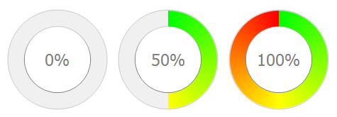
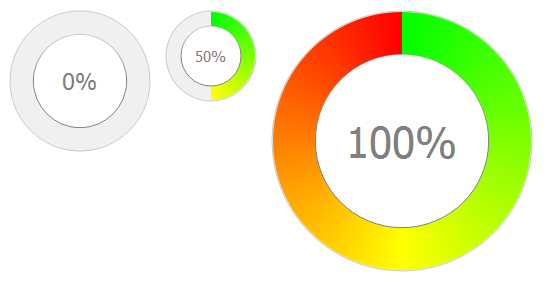
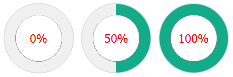
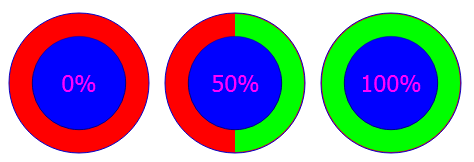

Main Page {#mainpage}
=========

# QCircularProgressBar v1.0
----------------------------
The **QCircularProgressBar** is a QtWidget developped in order to get a new style of QProgressBar, a circular progress bar.


## Current version
Version: 1.0

Autor  : William Gélard

Date   : April 2015


## Usage
* All you have to do is to donwload QCircularProgressBar.h and QCircularProgressBar.cpp files, add them to your project and enjoy !

```
$ git clone http://192.168.0.31/Wiwi/Qt_CircularProgressBarWidget.git
```

## Example Code
* This few lines below gives the simplest way to display a QProgressBar

```cpp
#include <QApplication>
#include "QCircularProgressBar.h"

int main(int argc, char *argv[])
{
    QApplication a(argc, argv);

    QCircularProgressBar cpb;
    cpb.setValue(75);
    cpb.show();

    return a.exec();
}
```


* A simple QProgressBar


## List of property
This Widget is completly customizable and you can change all the color:
* Enable/disable gradient color
* Progress bar color
* Background progress color
* Foreground color
* Border color
* Text color

### Notes
* The QCircularProgressBar inherit from QtWidget, so you can use the QtWidget methods.

## Example
* An example is availabe in the folder **QCircularProgressBar/example**

### ScreenShots
* Basic QCircularProgressBar



* resizable QCircularProgressBar



* A simple color QCircularProgressBar



* A total customizable QProgressBar



## License

MIT

## Contact
Feel free to contact me for any questions.
* Email: gelard.william@gmail.com