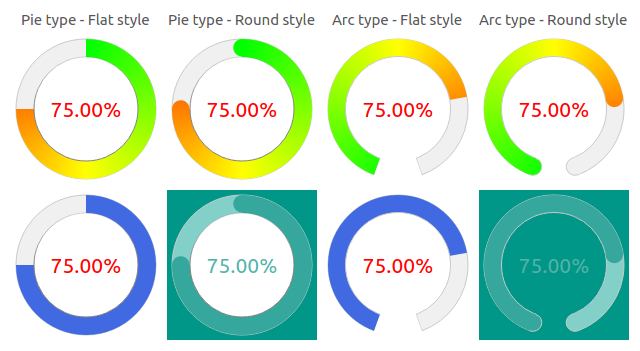

# QCircularProgressBar

[ ![License] [license-image] ] [license]

[license-image]: https://img.shields.io/badge/license-MIT-blue.svg?style=flat-square
[license]: LICENSE

Description
-----------
The **QCircularProgressBar** is a QtWidget developped in order to get a new style of QProgressBar, a circular progress bar inspired by [QtKnobs](https://github.com/ashish157/QtKnobs), a Qt and QML based Library/Plugin which provides different types of Knobs.

### Options
* Two types of QCircularProgressBar: Pie (default) or Arc
* Two styles: Flat (default) or Round
* Gradient mode available (by default)
* Fully customizable (see examples)

## Usage

* As any ordinary class file:
Include the files from QCircularProgressBar folder into your project: 
- QCircularProgressBar.h
- QCircularProgressBar.cpp

* As a shared library (todo)

### ScreenShots
* Basic QCircularProgressBar

* Example of possibilities

## Contact
* Email: gelard.william@gmail.com

*Note:* ***Please use the GitHub issues*** *for questions and problems regarding the QCircularProgressBar project.* ***Do not write emails.***
